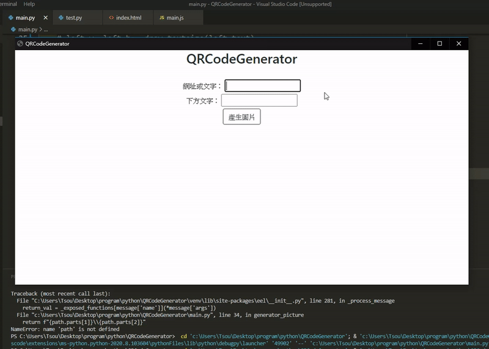

輸入以下指令安裝相關套件：
`pip install -r requirements.txt`

執行程式：
`python main.py`

輸入文字或網址產生出QRcode圖片，若需要在下方顯示文字只要在欄位中輸入文字即可。

按下產生圖片就會將結果顯示出來，接著右鍵下載就好了。

當按下`產生圖片`按鈕時，將兩個欄位的值傳送到python端，使用[QRcode](https://pypi.org/project/qrcode/)產生QRcode圖片，再使用[PIL](https://pypi.org/project/Pillow/)將文字寫入圖片中，儲存在`temp`資料夾中，關閉視窗後會將`temp`資料夾中的圖片刪除掉。